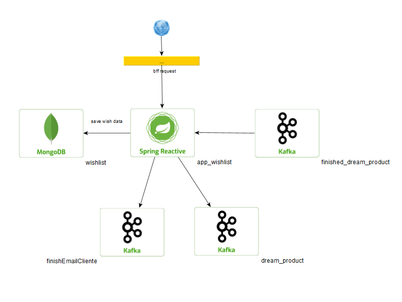

# wishlist
Dado a situação informada, vamos imaginar que já temos dentro do e-commerce toda parte já desenhada do
front e do bff que fara toda parte de conexão e seguranças primarais.
Passado pela requisição do BFF, temos a arquitetura abaixo onde app_wishlist é
responsavel por salvar, editar, visualizar e adicionar produtos no carrinho do
usuario dentro do MongoDB e tambem receber e enviar mensagem ao tópico se assim necessário.

Tendo em vista que a compra foi finalizada, será consumido uma mensagem no topico
finished_dream_product onde será deletado da base do mongo o carrinho e enviado uma
mensagem para os topicos finished_email_cliente e dream_produt onde eles daram 
continuidade a todo tramite de finalização da solicitação.

## Pré-requisitos.
Java 11. 
MongoDB. 
Kafka. 
Conhecimento em desenvolvimento REATIVO.

## Patterns
Build 
Facade

## Execução
Considerando que voce já esteja com o docker rodando as imagens do kafka e 
do mongoDB, configurar o arquivo application.yml.

### Observações adicionais
Até o momento não foi registrado nenhum problema ao executar o projeto.

### Históricos de tarefas solicitadas
#### LINK - história inicial.  
Uma das funcionalidades mais interessantes em um e-commerce
é a Wishlist, ou a lista de desejos. No e-commerce o cliente pode
realizar a busca de produtos, ou pode acessar a tela de detalhes
do produto. Em ambas as telas ele pode selecionar os produtos
de sua preferência e armazená-los na sua Wishlist. A qualquer
momento o cliente pode visualizar sua Wishlist completa, com
todos os produtos que ele selecionou em uma única tela.
#### O que deve ser feito? 
O objetivo é que você desenvolva um serviço HTTP resolvendo a
funcionalidade de Wishlist do cliente. Esse serviço deve atender
os seguintes requisitos:
- Adicionar um produto na Wishlist do cliente;
- Remover um produto da Wishlist do cliente;
- Consultar todos os produtos da Wishlist do cliente;
- Consultar se um determinado produto está na Wishlist do
  cliente;

#### Orientações
Imagine que esse serviço fará parte de uma plataforma
construída em uma arquitetura baseada em micro-serviços.
Portanto não se preocupe com a gestão das informações de
Produtos e/ou Clientes, coloque sua energia apenas no serviço da
Wishlist.
É importante estabelecer alguns limites para proteger o bom
funcionamento do ecossistema, dessa forma a Wishlist do cliente
deve possuir um limite máximo de 20 produtos.

#### Premissas
Linguagem Java 11 ou >
Framework http Spring Boot
Gerenciador de
dependência Maven ou Gradle
Banco de dados Qualquer NoSQL

   
LINK 02 
LINK 03 
LINK 04 
LINK 05 
LINK 06 

