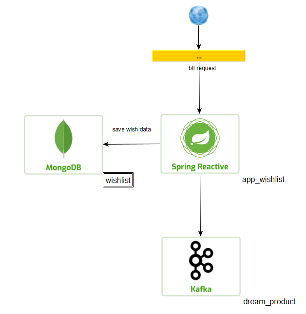

# wishlist
Dado a situação informada, temos dentro do e-commerce toda parte já desenhada do
front e do bff que fara toda parte de conexão e seguranças primarais.
Passado pela requisição do BFF, temos a arquitetura abaixo onde app_wishlist é
responsavel por salvar, editar, visualizar e adicionar produtos no carrinho do
usuario dentro do MongoDB e tambem enviar mensagem ao tópico se assim necessário.

Tendo em vista que a compra foi finalizada, devemos salvar as alterações no banco
de compra concluida e envia uma mensagem para o tópico dream_product onde outro 
APP iniciara todo tramite de envio do produto para o cliente.

## Pré-requisitos.
Java 11. 
MongoDB. 
Kafka.
Conhecimento em desenvolvimento REATIVO.

## Execução
Considerando que voce já esteja com o docker rodando as imagens do kafka e 
do mongoDB, configurar o arquivo application.yml.

### Observações adicionais
Até o momento não foi registrado nenhum problema ao executar o projeto.

### Históricos de tarefas solicitadas
LINK 01 
LINK 02 
LINK 03 
LINK 04 
LINK 05 
LINK 06 

